# Tier IV: Electricity unlock

Unlocks:
- 			Anvil
- 		Machining Bench
- 		Cement Mixer
- 		Concrete Furnace	
- 		Biofuel Composter
- 			Fabricator
- 		Biofuel Generator
- 		Electricity Tool

Ingots:
- 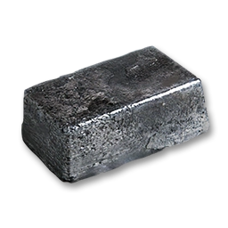		170
- 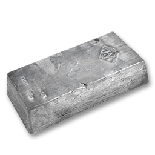		26
- 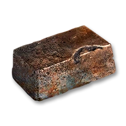		162
- 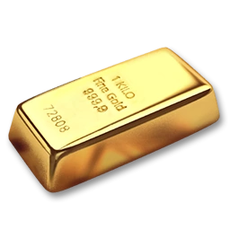		50
- 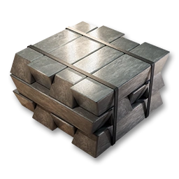	52
- 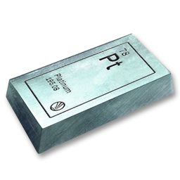	0

Metal Ores:
- 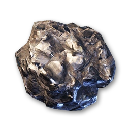		496
- 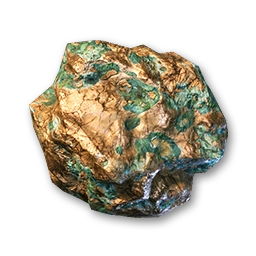		324
- 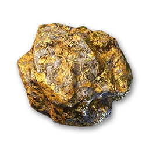		100
- 		52
- 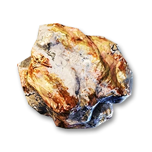		0

Other ores:
- 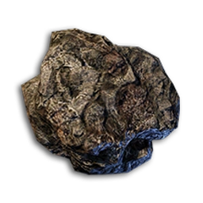		26+
- 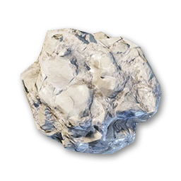		260
- 		0+
- 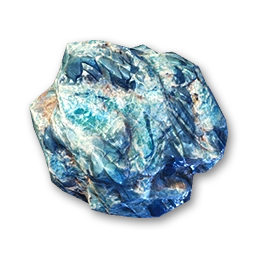		132+

Resources:
- 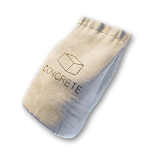		62
- 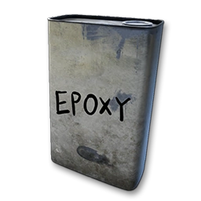			157
- 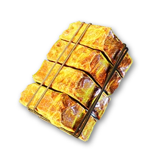		132
- 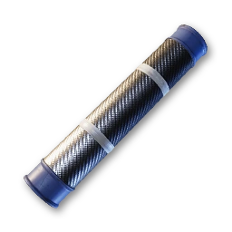		12
- 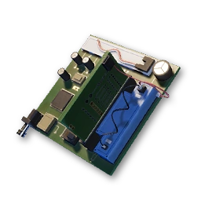		42

Basic Resources:
- 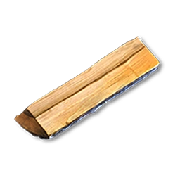			250+
- 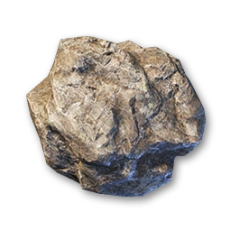			718+
- 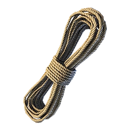			40+
